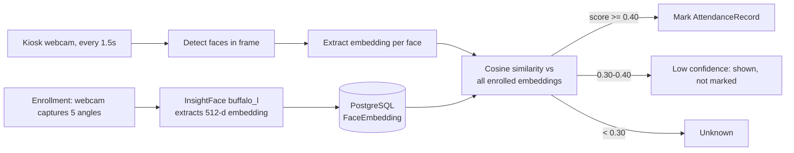

# FaceRoll — Face Recognition Attendance System

A classroom attendance system that recognizes enrolled students from a webcam
feed and marks attendance automatically. Built as a portfolio project to
demonstrate a full-stack ML-backed application: Django backend, a local
ArcFace face-recognition engine, and a browser-based kiosk UI.

## How it works



## Features

- Guided face enrollment (5 angles) with live rejection of bad frames (no face / multiple faces)
- Real-time recognition kiosk: bounding boxes, name/roll overlay, audio beep, live marked-list sidebar
- One active attendance session per section, duplicate-safe marking
- Teacher dashboard: today's present/absent per section, date-range filters
- Per-session report + CSV export, per-section date-range CSV (P/A grid + attendance %)
- Per-student 30-day attendance chart (Chart.js)
- `test_accuracy` management command to tune the match threshold against real photos
- Optional blink-based liveness check (MediaPipe FaceMesh, client-side) to block photo spoofing
- Consent checkbox at enrollment + "delete my biometric data" button (embeddings + photo wipe)

## Tech stack — and why

| Layer | Choice | Why |
|---|---|---|
| Backend | Django + PostgreSQL | Fast to build auth/admin/CRUD; Postgres handles JSONField vectors and concurrent session writes cleanly |
| Face recognition | InsightFace `buffalo_l` (ONNX, CPU) | Modern ArcFace embeddings, no GPU required, no per-call cost (vs. cloud face APIs) |
| Matching | numpy cosine similarity | A 512-d dot product against an in-memory (N×512) matrix is sub-millisecond even for a few hundred students |
| Frontend | Vanilla JS + `getUserMedia` | No build step, works in any modern browser, keeps the kiosk page dependency-free |
| Charts | Chart.js | Lightweight, no backend rendering needed |
| Liveness (optional) | MediaPipe FaceMesh, client-side | Needs a high-frequency landmark stream (~30fps) that would overload the InsightFace/Django process if done server-side |

## Setup (local, no Docker)

```bash
git clone <repo>
cd "Face-recognition attendance system"
python3.12 -m venv venv
source venv/bin/activate
pip install -r requirements.txt

createdb face_attendance   # requires local PostgreSQL running

cp .env.example .env       # then edit SECRET_KEY etc.

python manage.py migrate
python manage.py createsuperuser
python manage.py runserver
```

First recognition/enrollment request downloads the `buffalo_l` model
(~300MB) to `~/.insightface` — one-time, then cached.

## Setup (Docker)

```bash
docker compose up --build
```

Runs Postgres + the Django app together. The InsightFace model cache is
kept in a named volume (`insightface_cache`) so it isn't re-downloaded on
every rebuild.

## Threshold tuning

```bash
python manage.py test_accuracy /path/to/labeled_test_photos/
```

Folder layout: one subfolder per roll number, containing several real-world
photos of that student. The command reports correct/miss/false-match counts
at thresholds 0.30–0.50 so you can pick the value least likely to mark the
wrong student present. Set the winner as `FACE_MATCH_THRESHOLD` in `.env`.

**Real-condition checklist before deciding on a threshold:**
- Classroom lighting (not just your desk lamp)
- Glasses on and off
- Distance from camera (front row vs. back row)
- Camera mounted at the height it'll actually sit at (not eye-level on a laptop)
- A few "impostor" photos of people NOT enrolled, to check false-match rate

## Privacy & consent

This system stores biometric data (face embeddings) for real people. Handle
that responsibly:

- Enrollment requires an explicit **consent checkbox** before a student can
  be enrolled (`Student.consent_given`).
- Every student detail page has a **"Delete my biometric data"** button that
  permanently removes all `FaceEmbedding` rows and the enrolled photo, and
  resets consent to `False`.
- Face embeddings are stored as numeric vectors, not raw photos (except the
  optional enrollment photo) — they can't be reversed into an image, but
  they are still personally identifying data and should be treated as such
  in any report or write-up.
- Recommended for a class report: state retention period, who has access
  (only staff via Django admin / dashboard), and that deletion is available
  on request.

## Demo video shot list (60s)

1. **0:00–0:15 — Enrollment**: open a student's enroll page, show the 5
   guided-angle dots filling in green, end on "All angles captured".
2. **0:15–0:40 — Kiosk**: open the kiosk for an active session, walk into
   frame, show the green box + name/roll + beep + toast ("✓ Name — Marked
   HH:MM"), then walk in again to show the amber "already marked" state.
3. **0:40–0:60 — Dashboard**: cut to the dashboard showing present/absent
   counts updating, then the session report page, then hit "Export CSV" to
   show the downloaded file.

## Project structure

```
config/          Django project settings, root urls
attendance/      Main app: models, views, face_engine, matcher, management commands
templates/       Editorial-styled templates (base + attendance/*)
static/          CSS + JS (enroll.js, kiosk.js, liveness.js)
poc/             Standalone proof-of-concept scripts (no Django) used in Day 1-2
```
